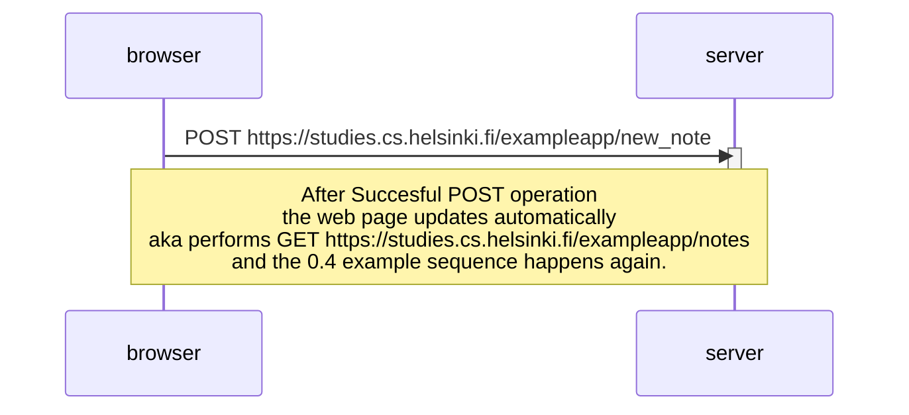

```mermaid
sequenceDiagram
    participant browser
    participant server

     browser->>server: POST https://studies.cs.helsinki.fi/exampleapp/new_note
    activate server
    deactivate server

    Note over browser,server: After Succesful POST operation <br/> the web page updates automatically <br/> aka performs GET https://studies.cs.helsinki.fi/exampleapp/notes <br/> and the 0.4 example sequence happens again.
```