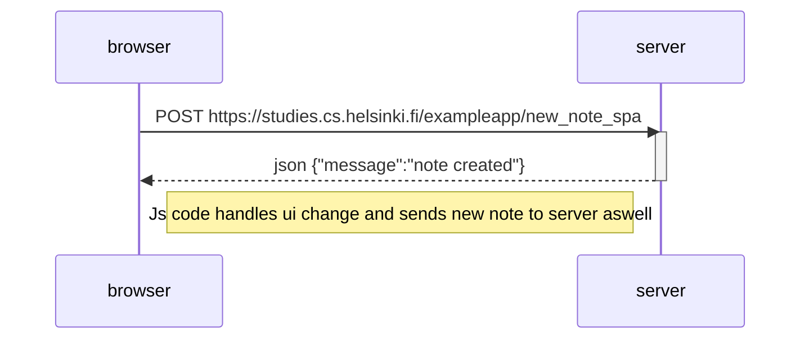

```mermaid
sequenceDiagram
    participant browser
    participant server
    
    browser->>server: POST https://studies.cs.helsinki.fi/exampleapp/new_note_spa
    activate server
    server-->>browser: json {"message":"note created"}
    deactivate server
    

    Note right of browser: Js code handles ui change and sends new note to server aswell
```